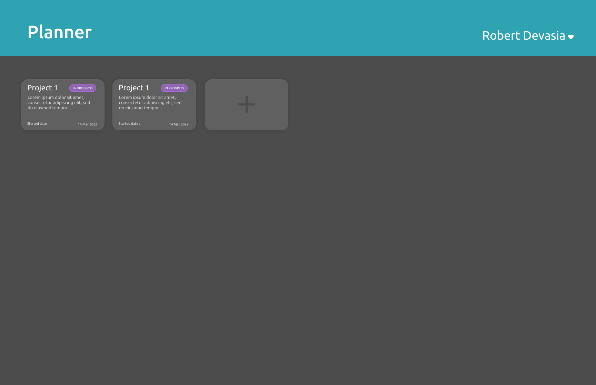
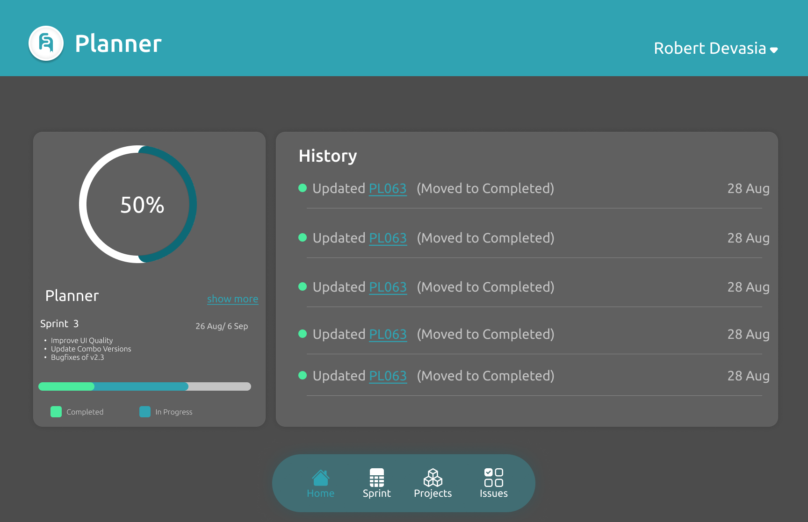

# Planner

Planner is a simple webapp built with **Express.js** and **Next.js**

### Resources Used

- [@docsploit/espress](https://www.npmjs.com/package/@docsploit/espress) - A wrapper module for express and other related functions
- [sequelize](https://www.npmjs.com/package/sequelize) - Relational Database ORM
- [Next.js]()

### Screenshot

### Execution

- Clone this repository
- `npm install`
- `npm run dev`

**Note:** You must have varifalia account and the details needed for verifying account ( Only for developement)
